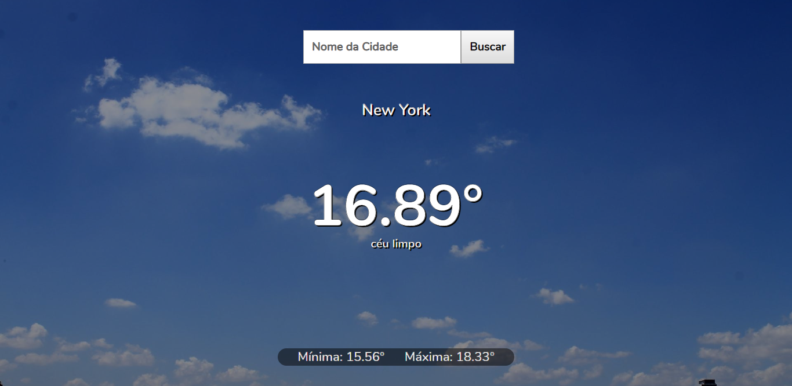
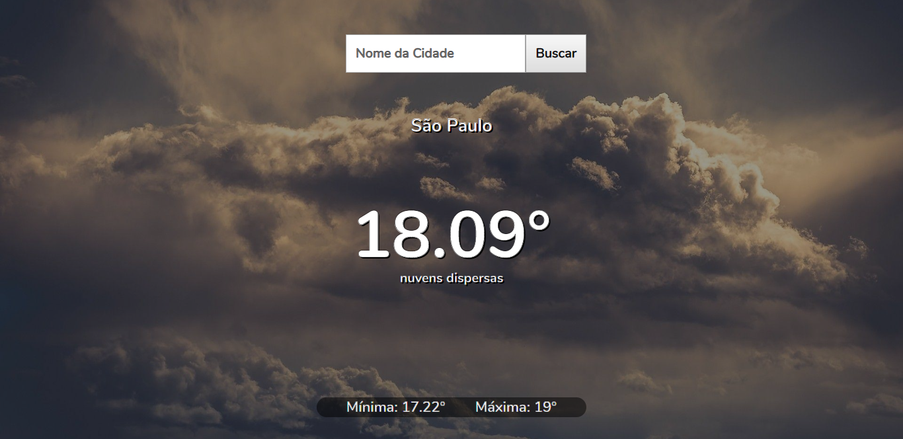
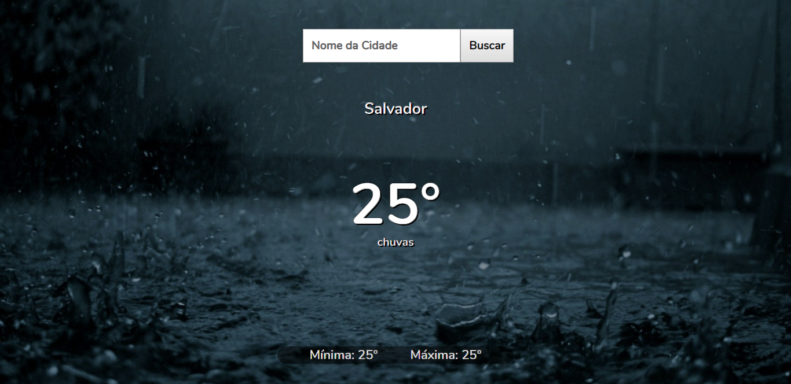
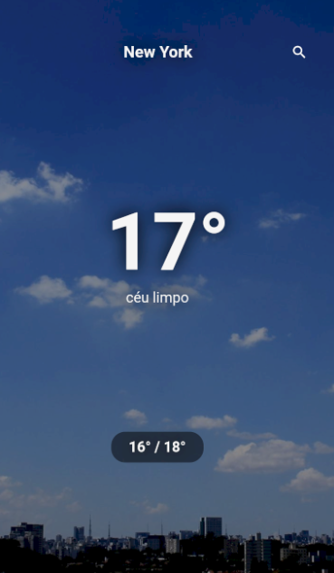
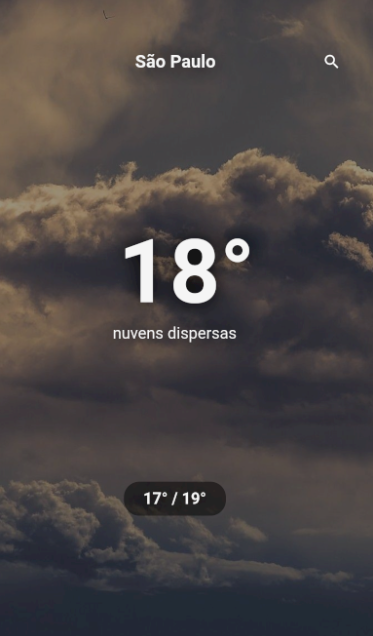
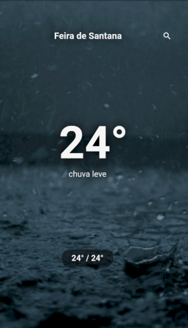

## Weather

Veja o clima da sua cidade.

## Sobre

Essa aplicação permite a visualização do clima de uma cidade específica. Por default é exibido o clima baseado na sua localização.

## Layout

<h3> Frontend </h3>

<h1>

</h1>
<h1>

</h1>
<h1>

</h1>

<h3> Mobile</h3>

<h1>

</h1>
<h1>

</h1>
<h1>

</h1>

## Executando o Weather

 - Para executar o backend ou frontend: npm start || yarn start
 - Para executar o mobile: flutter run

<h2 Tecnologias </h2>

As ferramentas usadas no desenvolvimento do projeto.

#### Backend:
 - Javascript
 - Express
 - Cors

#### Web:
- Typescript
- ReactJS 
- React Router Dom

#### Mobile:
- Flutter
